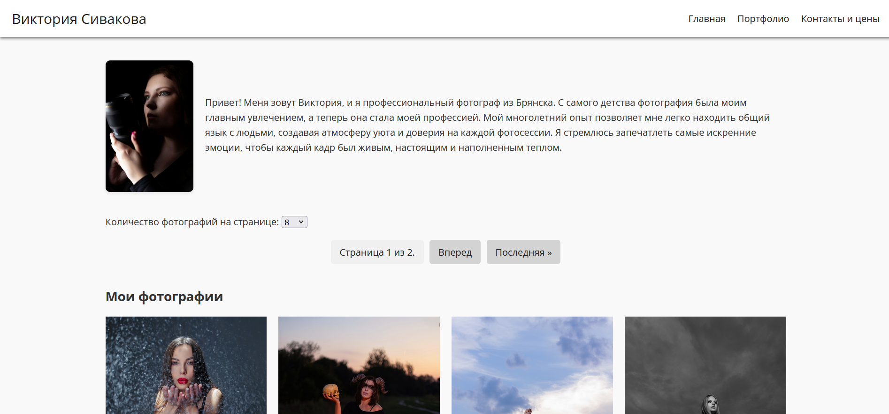
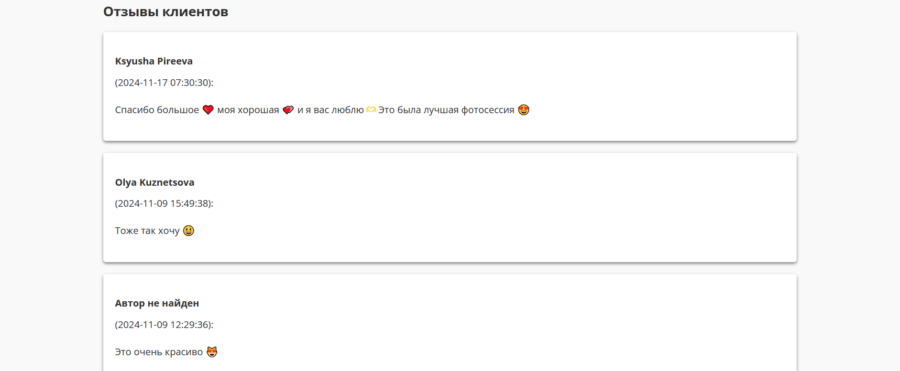
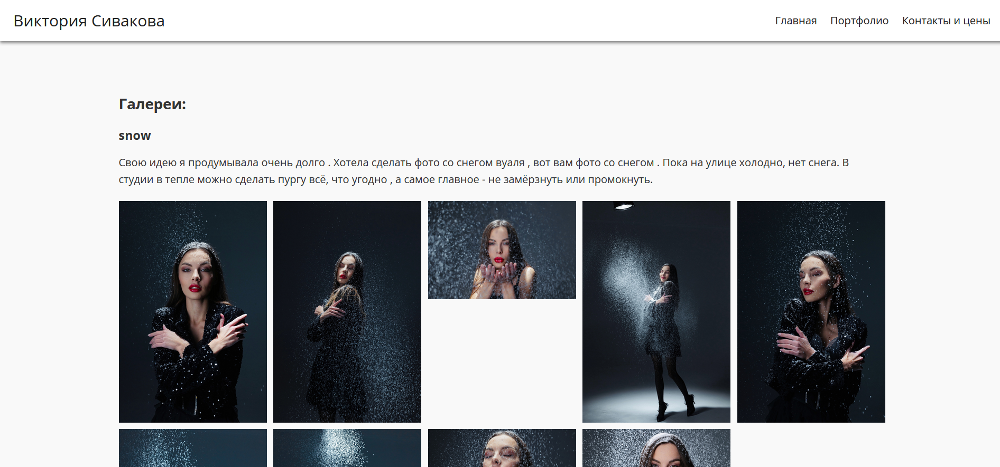
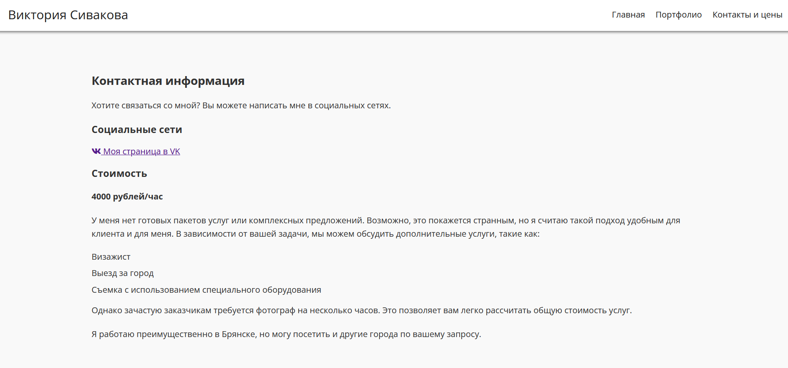

# Photographer Website

Простое и элегантное решение для фотографов, желающих представить свои работы в интернете.

## Описание

Этот сайт представляет собой адаптивный шаблон портфолио для фотографа. 
Он включает в себя: главную страницу, страницу портфолио и страницу с контактной информацией и стоимостью услуг.  Сайт оптимизирован для мобильных устройств и настольных компьютеров.

### Главная страница
Содержит информацию о фотографе, примеры фотографий и отзывы клиентов. Для удобства просмотра фотографий на странице реальзована пагинация. Фото можно добавлять через панель администатора



### Страница порфолио
Позволяет ознакомиться с работами фотографа. По тематике фотогрвфии объединены в галереи, содержащие название и описание


### Страница контакты и цены
Содержит ссылки для связи с фотографом и информацию о стоимости услуг

## Установка

1. Клонируйте репозиторий:

```bash
git clone https://github.com/daniilseliverstov/Photographer_website.git
```
2. Откройте проект в предпочитаемом редакторе
3. Запустите локальный сервер для просмотра сайта

